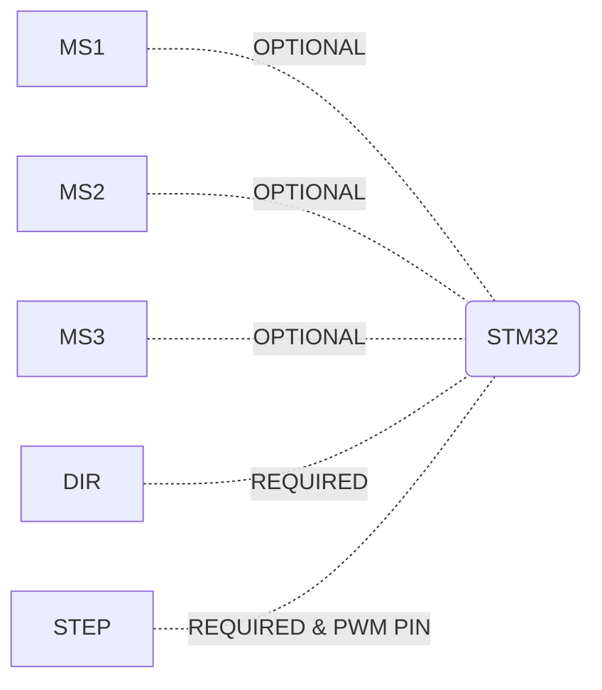

# A4988 STEP MOTOR DRIVER

    
## How is working?
- Include a4988 header file,
- Create a motor_pins_t object and set pin and port,
- Create a a4988_t object and initialization,
- is_pwm_work variable set true in your a4988_t object,
- Set pulse width on `a4988DrvSetPwmPulseWidth(a4988_t * drv, uint8_t pulse_width); ` method,
- Set direction and step (on percent for now) `a4988DrvSetStepAndDirection(a4988_t * drv, uint32_t step, bool direction)` method.

```C
...
#include "a4988.h"
...
int main(void){
...
  motor_pins_t dir_pin = {
		  .pin = drv_pin_name_Pin,
		  .port = drv_pin_name_GPIO_Port
  };
  a4988_t test_drv = a4988DrvInit(&your_tim_handle, &dir_pin, timer_channel);
  test_drv.is_pwm_work = true;
  a4988DrvSetPwmPulseWidth(&test_drv, 128);
  a4988DrvSetStepAndDirection(&test_drv, 25, CW); //Go to %25 step Clockwise
...
}
```
## Bugs 
- `a4988DrvSetStepAndDirection(a4988_t * drv, uint32_t step, bool direction)` method not work true, must be going only wanted tour.

## LICENSE
MIT License

Copyright (c) 2022 Neşet Aydın

Permission is hereby granted, free of charge, to any person obtaining a copy
of this software and associated documentation files (the "Software"), to deal
in the Software without restriction, including without limitation the rights
to use, copy, modify, merge, publish, distribute, sublicense, and/or sell
copies of the Software, and to permit persons to whom the Software is
furnished to do so, subject to the following conditions:

The above copyright notice and this permission notice shall be included in all
copies or substantial portions of the Software.

THE SOFTWARE IS PROVIDED "AS IS", WITHOUT WARRANTY OF ANY KIND, EXPRESS OR
IMPLIED, INCLUDING BUT NOT LIMITED TO THE WARRANTIES OF MERCHANTABILITY,
FITNESS FOR A PARTICULAR PURPOSE AND NONINFRINGEMENT. IN NO EVENT SHALL THE
AUTHORS OR COPYRIGHT HOLDERS BE LIABLE FOR ANY CLAIM, DAMAGES OR OTHER
LIABILITY, WHETHER IN AN ACTION OF CONTRACT, TORT OR OTHERWISE, ARISING FROM,
OUT OF OR IN CONNECTION WITH THE SOFTWARE OR THE USE OR OTHER DEALINGS IN THE
SOFTWARE.